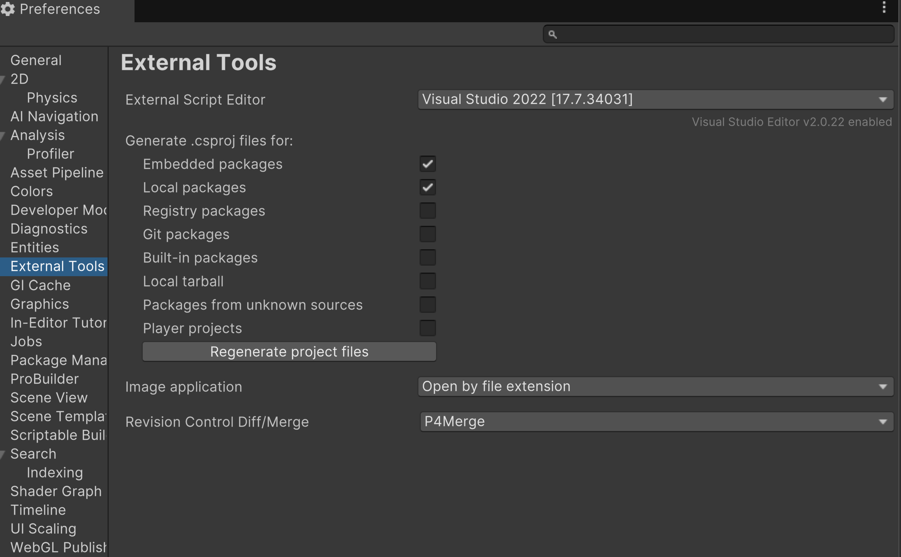

# Using the Visual Studio Editor package

To use the package, go to **Edit** > **Preferences** > **External Tools** > **External Script Editor** and select the version of **Visual Studio** you have installed. When you select this option, the window reloads and displays settings that control production of .csproj files.

## Generate .csproj files

Each setting in the table below enables or disables the production of .csproj files for a different type of package.When you click **Regenerate project files**, Unity updates the existing .csproj files and creates the necessary new ones based on the settings you choose.

These settings control whether to generate .csproj files for any installed packages. For more information on how to install packages, see [Adding and removing packages](https://docs.unity3d.com/Manual/upm-ui-actions.html).

| **Property** | **Description** |
|---|---|
|       **Embedded packages** | Any package that appears under your project’s Packages folder is an embedded package. An embedded package is not necessarily built-in; you can create your own packages and embed them inside your project. This setting is enabled by default.  For more information on embedded packages, see [Embedded dependencies](https://docs.unity3d.com/Manual/upm-embed.html). |
|       **Local packages** | Any package that you install from a local repository stored on your machine, but from outside of your Unity project. This setting is enabled by default. |
|       **Registry packages** | Any package that you install from either the official Unity registry or a custom registry. Packages in the Unity registry are available to install directly from the Package Manager. For more information about the Unity package registry, see The Package Registry section of the [Unity Package Manager documentation](https://docs.unity3d.com/Packages/com.unity.package-manager-ui@1.8/manual/index.html#PackManRegistry).   For information on how to create and use custom registries in addition to the Unity registry, see [Scoped package registries](https://docs.unity3d.com/Manual/upm-scoped.html). |
|       **Git packages** | Any package you install directly from a Git repository using a URL. |
|       **Built-in packages** | Any package that is already installed as part of the default Unity installation. |
|       **Tarball packages** | Any package you install from a GZip tarball archive on the local machine, outside of your Unity project. |
|       **Unknown packages** | Any package which Unity cannot determine an origin for. This could be because the package doesn’t list its origin, or that Unity doesn’t recognize the origin listed. |
|       **Player projects** | For each player project, generate an additional .csproj file named ‘originalProjectName.Player.csproj’. This allows different project types to have their code included in Visual Studio’s systems, such as assembly definitions or testing suites. |
